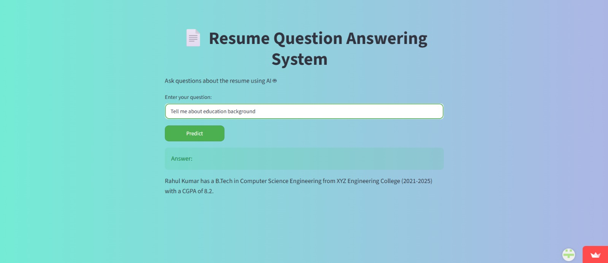

# Resume RAG System

This project is a **Resume Question Answering System** built using **RAG (Retrieval Augmented Generation)**.

The system reads a resume PDF and answers questions based on the resume content using Artificial Intelligence.

---

## 🚀 Features

- Resume PDF processing
- Ask questions about resume
- AI-generated answers
- Semantic search using embeddings
- Vector database storage
- Simple Streamlit user interface

---

## 🛠 Technologies Used

- Python
- Streamlit
- LangChain
- Google Gemini API
- ChromaDB
- HuggingFace Embeddings
- PyPDF

---

## 📂 Project Structure

Resume-RAG-System/
│
├── app.py
├── requirements.txt
├── README.md
├── .env.example
├── .gitignore
│
└── data/
      sample_resume.pdf

## ⚙ Installation Steps

### Step 1 – Download the Project

Clone the repository:

git clone https://github.com/ashreyasureddy/resume-rag-system.git

Or download the ZIP file and extract it.

---

### Step 2 – Open Project Folder

Open the project folder in terminal or VS Code:

cd resume-rag-system

---

### Step 3 – Create Virtual Environment (Recommended)

Create virtual environment:

python -m venv envi

Activate environment (Windows):

envi\Scripts\activate

---

### Step 4 – Install Required Libraries

Install dependencies:

pip install -r requirements.txt

---

### Step 5 – Setup API Key

Create a file named .env

Add your Google API key:

GOOGLE_API_KEY=your_api_key_here

You can get API key from:

https://makersuite.google.com/app/apikey

---

### Step 6 – Run the Application

Run the Streamlit app:

streamlit run app.py

---

### Step 7 – Open in Browser

Open this link in your browser:

http://localhost:8501

---
## 📸 Screenshot

## 💡 Example Questions

You can ask questions like:

- What is the candidate's name?
- What skills are mentioned?
- What projects are listed?
- What is the education qualification?
- Suggest suitable job roles
- What programming languages are known?

---

## 📌 How It Works

1. Resume PDF is loaded
2. Text is split into chunks
3. Embeddings are created
4. Stored in Chroma Vector Database
5. Relevant content is retrieved
6. Gemini LLM generates answer

This process is called **Retrieval Augmented Generation (RAG)**.

---

## 🔒 API Key Security

API key is stored in `.env` file.

`.env` file is ignored using `.gitignore` to protect API key.

Use `.env.example` file as reference.

---

## 👨‍💻 Author

Name: Sureddy Ashreya

Project: Resume RAG System

Technology: Generative AI
